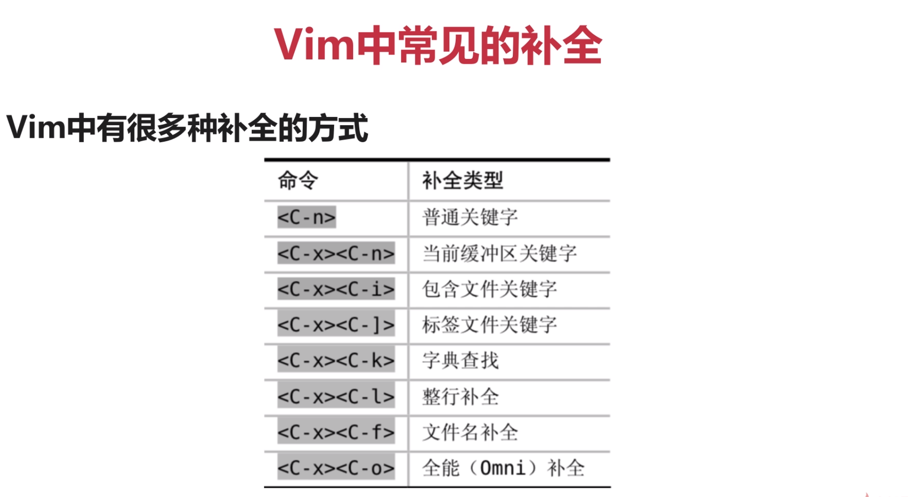
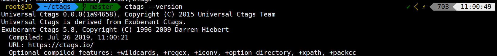

# Vim学习笔记

原教程：玩转Vim 从放弃到爱不释手 https://www.imooc.com/learn/1129

十分感谢 [PegasusWang](https://www.imooc.com/u/2301800/courses?sort=publish) 提供的高质量免费教程。

本文档基于 [PegasusWang](https://www.imooc.com/u/2301800/courses?sort=publish) 的视频教程，在此之上略有精简和修改，并增加一些额外内容（YCM、科学上网、auto-pairs等等）。第二章基础部分省略了很多内容，初学者可以直接看教程。


##  准备工作

你可以选择只安装vim8.1或者同时安装YCM补全工具。

只安装Vim8.1

https://github.com/ycm-core/YouCompleteMe/wiki/Building-Vim-from-source

https://vi.stackexchange.com/questions/18433/installing-or-building-vim-with-python3-support-for-python-3-7-x-on-linux

```shell
# 1. install dependencies
sudo apt install libncurses5-dev libgnome2-dev libgnomeui-dev \
    libgtk2.0-dev libatk1.0-dev libbonoboui2-dev \
    libcairo2-dev libx11-dev libxpm-dev libxt-dev python-dev \
    python3-dev ruby-dev lua5.1 lua5.1-dev libperl-dev git
    
# 2. remove vim 
sudo apt remove vim vim-runtime gvim
sudo apt remove vim-tiny vim-common vim-gui-common vim-nox


# if pyenv is installed, set the python command to point at the system python with:
# pyenv shell system

# 3. configure 
# 如果提示checking if compile and link flags for Python 3 are sane... no
# 检查with-python3-config-dir，选择自己的python路径，重新clone一份vim源码再编译
cd ~
git clone https://github.com/vim/vim.git
cd vim
./configure --with-features=huge \
            --enable-multibyte \
            --enable-rubyinterp=yes \
            --enable-python3interp=yes \
            --with-python3-command=python3.5 \
            --with-python3-config-dir=/usr/lib/python3.5/config-3.5m-x86_64-linux-gnu
 \
            --enable-perlinterp=yes \
            --enable-luainterp=yes \
            --enable-gui=gtk2 \
            --enable-cscope \
	   --prefix=/usr/local
	   
make VIMRUNTIMEDIR=/usr/local/share/vim/vim81  # 此处视版本而定

# 4. use make to install
cd ~/vim
sudo make install

# 5.可选 Set vim as your default editor with update-alternatives.
sudo update-alternatives --install /usr/bin/editor editor /usr/bin/vim 1
sudo update-alternatives --set editor /usr/bin/vim
sudo update-alternatives --install /usr/bin/vi vi /usr/bin/vim 1
sudo update-alternatives --set vi /usr/bin/vim
```


安装Vim8.1和YCM补全插件

YCM比较难安装，尤其是在有GFW的情况下。但是功能强大，速度快。你也可以安装后面的deoplete.nvim。

https://github.com/ycm-core/YouCompleteMe

```shell
# 1. install dependencies
sudo apt install libncurses5-dev libgnome2-dev libgnomeui-dev \
    libgtk2.0-dev libatk1.0-dev libbonoboui2-dev \
    libcairo2-dev libx11-dev libxpm-dev libxt-dev python-dev \
    python3-dev ruby-dev lua5.1 lua5.1-dev libperl-dev git
    
# 2. remove vim 
sudo apt remove vim vim-runtime gvim
sudo apt remove vim-tiny vim-common vim-gui-common vim-nox


# if pyenv is installed, set the python command to point at the system python with:
# pyenv shell system

# 3. configure 
# 如果提示checking if compile and link flags for Python 3 are sane... no
# 检查with-python3-config-dir，选择自己的python路径，重新clone一份vim源码再编译
cd ~
git clone https://github.com/vim/vim.git
cd vim
./configure --with-features=huge \
            --enable-multibyte \
            --enable-rubyinterp=yes \
            --enable-python3interp=yes \
            --with-python3-command=python3.5 \
            --with-python3-config-dir=/usr/bin/python3-config \
            --enable-perlinterp=yes \
            --enable-luainterp=yes \
            --enable-gui=gtk2 \
            --enable-fail-if-missing \
            --enable-cscope \
	        --prefix=/usr/local
	   
sudo make

# 4. use make to install
cd ~/vim
sudo make install

# 5. install plug-manager
curl -fLo ~/.vim/autoload/plug.vim --create-dirs \
    https://raw.githubusercontent.com/junegunn/vim-plug/master/plug.vim


# 6. install YCM
# 依赖项
sudo apt install build-essential cmake python3-dev

# 将下面内容复制到.vimrc中
call plug#begin('~/.vim/plugged')
    " 在这里插入要启用的插件 其实就是Plug加上github的地址。
    Plug'ycm-core/YouCompleteMe'
call plug#end()

# 退出vim重进，执行:PlugInstall (如果后续遇到GFW而出错，看下方解决办法)

# 如果期间遇到The ycmd server SHUT DOWN (restart with ':YcmResta...  错误
# https://github.com/ycm-core/YouCompleteMe/issues/2831
# https://github.com/ycm-core/YouCompleteMe/issues/914
cd ~/.vim/plugged/YouCompleteMe
git submodule update --init --recursive

# 这步可能遇到问题ERROR: Python headers are missing in /usr/include/python3.6m.
#https://www.reddit.com/r/vim/comments/9z0ee5/vundle_youcompletemeycm_python_headers_mssing/
# 两种选择：
# 不需要c系语言补全
python3 install.py  # 或python3.5 install.py 取决于你设置的python版本

# 需要c系语言补全
python3 install.py --clang-completer # 或python3.5 install.py --clang-completer

```

编译完成：


可能会遇到wall：

或者用v2ray 科学爱国：vmess协议  此处不做过多解释。

https://toutyrater.github.io/basic/vmess.html

https://v2ray.com/chapter_02/protocols/vmess.html#serverobject

```shell
# 下载脚本：
wget https://install.direct/go.sh

# 执行脚本安装 V2Ray:
sudo bash go.sh

# 编辑配置文件
vim /etc/v2ray/config.json

# 参考配置文件（vmess）修改配置，替换配置文件内容
{
  "inbounds": [
    {
      "port": 1080, 
      "protocol": "socks", 
      "sniffing": {
        "enabled": true,
        "destOverride": ["http", "tls"]
      },
      "settings": {
        "auth": "noauth"  
      }
    }
  ],
  "outbounds": [
    {
      "protocol": "vmess", 
      "settings": {
        "vnext": [
          {
            "address": "修改此处为你的server地址", 
            "port": 443,  
            "users": [
              {
                "id": "修改此处为你的ID",  
                "alterId": 修改此处为你的参数 
              }
            ]
          }
        ]
      }
    }
  ]
}

# 重启
systemctl restart v2ray 

# 可能需要这步
git config --global http.sslVerify true

# 设置全局代理 也可以在 .zshrc或者.bashrc里持久化配置
export HTTP_Proxy=http://127.0.0.1:1080
export HTTP_Proxy=https://127.0.0.1:1080

# 设置git全局代理
git config --global http.proxy 'socks5://127.0.0.1:1080'
```


## 第2章 初识 Vim（本章精简较多内容，有需要的话请看原视频）

### 2-1 初识 Vim


i 在光标前插入（insert）

a 在光标后插入（append）

A 在行后插入（append after line）

o 在当前行下方插入（创建新行 open a line below）

I 在行前插入（insert before line）

O 在当前行上方插入 （append a line above）

### 2-2 Vim多种模式

除了普通模式、编辑模式，还有:cmd命令模式和visual可视化模式

#### 普通模式

分屏 :vs（vertical split）:sp（split）

全局替换  :% s/foo/bar/g  （表示将所有foo替换为bar，g表示全局替换）

设置行号 :set nu

#### 可视模式

一般用来块状选择文本

使用V选择行

使用ctrl+v进行方块选择

### 2-3 Vim插入模式小技巧

**注意是插入模式下才能用（或者终端命令）**

ctrl h 删除上一个字符

ctrl w 删除上一个单词

ctrl u 删除当前行

**终端命令中的其他快捷键：**

ctrl a 移动到开头

ctrl e 移动到结尾

ctrl b 光标前移

ctrl f 光标后移

**快速切换insert和normal模式**

使用ctrl c代替esc（可能会中断某些插件） 或者ctrl [

gi 快速跳转到最后一次编辑的地方并进入插入模式

### 2-4  Vim快速移动大法

**单词间移动：**（word指以非空白符分割的单词，WORD以空白符分割的单词）

w/W 移动到下一个word/WORD开头

e/E 移动到下一个word/WORD结尾

b/B 移动到上一个word/WORD开头（backward）

**行间搜索移动:** 同一行快速移动的方式其实是搜索一个字符并且移动到该字符

f{char} 可以移动到char字符上，t移动到char的前一个字符 比如fg就是跳转到当前行第一个g位置

如果重复的字母导致第一次没搜到，可以用

 ; 继续搜该行下一个 , 继续搜该行上一个 （后续的改映射可能导致此功能失效）

F 表示反过来搜光标前面的字符

**水平移动**

0 移动到行首  $ 移动到行尾  （常用）

^ 移动到第一个非空白字符 g_移动到行尾非空白字符 （不常用）

^ 也可以使用0w替代

**垂直移动**  可以用插件章节中的easy-motion替代

在句子和段落间移动（不常用）

使用( )在句子间移动，你可以用:help ( 来查看帮助

使用{}在段落间移动

**页面移动**

翻页命令太多，记住一些常见的就能满足需求

**ctrl u 、ctrl f** 上下翻页   

**zz** 把当前行置为屏幕中间

gg/G 移动到文件开头和结尾

**ctrl o** 快速返回上个位置

H/M/L 跳转到文件开头、中间和结尾

### 2-5 Vim快速增删改查

##### Vim增加字符

使用 a i o 或者 A I O进入插入模式

##### Vim快速删除

x 删除字符 

d 配合文本对象删除一个单词  

例如daw（delete around word）快速删除一个单词  diw删除单词但不删除单词周围空格

**dt)** 删除直到右括号内所有内容

d$ 快速删除到行尾

d0 删除光标到行头 dG 删除光标之后的所有内容

d和x都可以配合数字执行多次

##### visual模式下

V可以进入行选模式，配合删除操作

##### Vim快速修改

常用三个 r （replace）c（change） s（substitute）

normal模式下用r可以替换一个字符。R一直输入一直替换

s替换并进入插入模式（4s 删除4个字符并进入插入模式）。 S整行清空并进入插入模式

c删除并进入插入模式（**caw**  删除当前单词并进入插入模式change a word）。C删除整行并进入插入模式 

使用c配合文本对象可以实现快速修改 

##### Vim查询

使用/或?进行前向/反向搜索

使用n/N跳转到下一个或者上一个匹配

使用*或者#进行当前单词的前向和后向匹配

:syntax on 可以打开语法高亮

:set hls 表示搜索词高亮

**:set incsearch** 增量搜索，边搜索边高亮

### 2-6 Vim搜索替换 

##### vim替换命令

substitute命令允许我们查找并替换文本，并且支持正则式

```
:[range] s[ubstitute]/{pattern}/{string}/[flags]
```

range表示范围 比如 :10,20 表示10-20行，%表示全部

pattern是要替换的模式，string是替换后文本

flags 是替换标志位：

​	g（global）表示全局范围内执行

​	c（confirm）表示确认，可以确认或者拒绝修改

​	n（number）报告匹配到的次数而不替换，可以用来查询匹配次数

##### 替换时的正则表达式

{pattern}除了可以直接输入要替换的单词外，还能输入正则表达式

比如下面这个精确匹配quack，而不匹配do_quack

```
:% s/\<quack\>/jiao/g 
```

其他正则知识 https://www.jb51.net/tools/zhengze.html

### 2-7 Vim多文件操作

几个多文件操作的概念

Buffer 打开的一个文件的内存缓冲区

window 是buffer可视化的分割区域

Tab 可以组织窗口为一个工作区


##### Buffer

vim打开文件后会加载文件内容到缓冲区，之后的修改都是针对内存中的缓冲区，并不会直接保存到文件，直到执行写入命令的时候才会把修改内容写入到文件里

##### Buffer切换(大屏幕可以使用多窗口或者tmux替代此操作)

打开多个文件时会有多个buffer，如何在多个buffer中切换？

使用 `:e 文件名`  打开多个文件

使用`:ls`会列举当前缓冲区，然后使用`:b n` 跳转到第n个缓冲区

其他跳转命令：

```
 :bpre :bnext :bfirst :blast 或者 :b buffer_name加上tab补全来跳转
```

##### Window

一个缓冲区可以分割成多个窗口，每个窗口也可以打开不同缓冲区

ctrl w + s 水平分割  ctrl w + v 垂直分割 或者:sp  :vs


切换窗口快捷键：


不同窗口编辑同一Buffer，修改会同步到其他窗口

##### 重排窗口（使用较少）


##### Tab将窗口分组（使用较少）

tab是可以容纳一系列窗口的容器 :h tabpage

Vim的tab和其他编辑器不太一样，可以想象成linux的虚拟桌面

比如一个Tab全用来编辑Python文件，一个Tab全是HTML文件


插件篇会配合ctrlp和nerdtree快速操作多个文件

### 2-8 什么是Vim的text object

##### 文本对象

Vim里文本也有对象的概念，比如一个单词，一段句子，一个段落

通过操作文本对象来修改比修改单个单词快速

回忆一下dw（删除一个单词）

```
[number]<command>[text object]
```

number 表示次数，command表示命令 d(elete) c(hange),y(ank)

text object 是要操作的文本对象，比如单词w，句子s，段落p

比如下图中的`iw`(inner word) 和 `aw` (a word 选中单词和前后空格)


其他示例：


比如要快速选中双引号中内容：`vi"`  

选中双引号内容删除并进入插入模式 `ci"`   连双引号一起删除 `ca"`

举例：要删除python字典中的内容： `ci}` 或`ci{`


有些插件扩展了文本对象，比如vim-go可以使用f表示一个函数

### 2-9 Vim复制粘贴和寄存器的使用

##### normal模式：y p d

一般使用v模式选中复制内容，再按p粘贴

配合文本对象：比如使用yiw复制一个单词，yy复制一行 （c在normal模式下是change，已经被占用了，所以复制用的yank）

##### insert模式

shift + insert 粘贴

.vimrc中如果设置了autoindent，粘贴会出现缩进错乱

通过 :set paste   :set nopaste 解决 （后续设置映射为F2 简化操作）

#### vim的寄存器

vim在normal模式下复制、粘贴的内容去哪了？

Vim操作的是寄存器而不是系统剪贴板，这和其他编辑器不同

默认使用d删除和y复制的内容都放到了“无名寄存器”中

xp可以实现两个字母对调

##### 深入寄存器

Vim使用多组寄存器

通过"{register}前缀可以指定寄存器，不指定默认用无名寄存器

比如使用"ayiw 复制一个单词到寄存器a中，"bdd 删除当前行到寄存器b中，"bp 粘贴b寄存器的内容到当前文档

使用 `:reg a` 查看a寄存器内容

""表示无名寄存器，""p就相当于p

##### 其他常见寄存器

除了a-z寄存器，还有其他常见寄存器

复制专用寄存器 "0  使用y复制文本的同时会被拷贝到复制寄存器0

系统剪贴板 "+ 可以在复制前加上 "+ 复制到系统剪贴板 （常用于将vim内容复制到其他软件中）

其他一些寄存器比如 "% 当前文件名    ". 上次插入的文本 （不常用）

`:echo has('clipboard')` 如果输出为1就系统剪贴板支持这个特性。

`:set clipboard=unnamed` 可以让你直接复制粘贴系统剪贴板内容

### 2-10 Vim 如何用宏完成强大的批量操作

##### macro


宏可以看成是一系列命令的集合

我们可以使用宏录制一些操作，然后用于回放

宏可以非常方便地把一系列命令用在多行文本上（批量编辑）

##### 如何使用宏

宏的使用分为录制和回放

vim用q来录制/结束录制宏，

使用q{register}选择要保存的寄存器，把录制的命令保存其中

使用@{register} 回放寄存器中保存的一系列命令

因此可以使用q录制给一行加上双引号，之后使用q退出，在剩下的所有行回放


执行`qa`：此时已经开始录制到a寄存器（recording @a）


再执行 `I"` `Esc` `A"` `Esc` `q` 完成增加双引号工作，结束录制

然后再按 V G 进入行选并选中剩下所有行

: 进入命令行模式 加上normal @a    （在normal模式下执行命令）


这样就完成了。


另一种方法

V G 全选所有行，`:'<,'>normal I"`  `:'<,'>normal A"`  也可以完成需求

### 2-11 Vim补全

vim的几种补全方式



最常用的三种：

ctrl n 和 ctrl p补全单词

ctrl x ctrl f补全文件名   比如with open('./txt.py')


ctrl x ctrl o 全能补全（一般需要插件），需要在文件中开启文件类型 `:filetype on`  `:set filetype`

补全时如何输入当前文件名？google一下 `:r! echo %`     %代表当前文件名

目前这些补全都是基于文本，通过后面的插件可以实现语义补全。

### 2-12  给 Vim 换个配色

使用`:colorscheme` 显示当前主题配色，默认是default

使用`:colorscheme`  ctrl + d 可以显示所有配色

使用`:colorscheme 配色名` 就可以修改配色

google直接搜vim colorscheme就可以

举例：

将https://github.com/w0ng/vim-hybrid 中的colors文件夹中的内容复制到~/.vim/colors中

再在vim中输入`:colorscheme hybrid`j 就可以了 

### 2-13 裸 Vim 也很强

本章使用未配置的vim，目的是想让初学者掌握基础知识。


## 第3章 编写Vim配置

### 3-1 编写vim配置

Linux/Unix： vim ~/.vimrc  

Win：vim $MYVIMRC 环境变量


常用设置：(写入.vimrc，完成配置持久化，不用每次进入vim都set nu)

比如一开始我们vim编辑代码没有行号和语法高亮，可以在.vimrc中增加这两句：

```
set number
syntax on
```

保存并退出，下次用vim打开时就有行号和语法高亮了。（不需要source .vimrc）

```
set pastetoggle=<F2> # 按F2进入粘贴模式，再按退出，就不用：set paste了
```

其他例子


#### vim中的映射

vim中的映射比较复杂，源于vim有多种模式。

设置一下leader键 `let mapleader = ','   常用的是逗号或空格

比如用 `inoremap <leader>w <Esc>:w<cr>` 在插入模式保存，即按,w 就能直接保存，(<cr>相当于回车，这条语句将,w 和后面的一系列操作对应。因为普通的保存方法就是先按esc进入普通模式，再输入:w 再按回车保存。)

修改完后如何让配置生效？

可以退出vim重进，也可以source ~/.vimrc


`inoremap jj <Esc>`将jj映射为Esc键

还有一些切换分屏快捷键

```
" switch window
noremap <C-h> <C-w>h
noremap <C-j> <C-w>j
noremap <C-k> <C-w>k
noremap <C-l> <C-w>l
```

比如用:vs 竖分屏，:sp横分屏，然后可以用ctrl+hjkl在各个窗口之间移动

还可以加JSON格式化的命令

`com! FormatJSON %!python3 -m json.tool` 即用快捷键调用外部命令

`:sp ./demo.json`在vim中表示用横分屏的格式打开文件


vim脚本：vimscript  为vim高级玩家准备


vim中输入`:h option-list` 可以看到所有提示（h代表help）

还有一些插件配置、自动插入文件头等：


可以参考学习的配置：https://github.com/fatih/vim-go-tutorial


### 3-2 Vim映射

映射一些快捷键或者修改现有设置。


#### 基本映射

指normal模式下的映射

使用map就可以实现映射，比如vim中输入:map - x  然后按 - 就会删除

:map <space> viw 告诉vim按下空格时选中整个单词

:map <c-d> dd 可以使用 ctrl+d 执行 dd删除一行

想取消上面暂时性的映射 - x（因为没有写入.vimrc ，当然不用加:），输入:unmap -

#### 模式映射

vim常用模式 normal、visual、insert都可以映射，分别为nmap、vmap、imap，映射只在对应模式有效。

例如  :vmap \ U 在**visual模式**下选中文本大写（u/U转换大小写）

实现在insert模式下映射ctrl+d来删除一行 :imap <c-d> <Esc>ddi  (注意<Esc>和ddi之间不能有空格！)

#### 现有映射的问题：

比如有两个映射:

```
:nmap - dd
:nmap \ -
```

vim如何工作？

如果有重复定义，vim会一直搜索到最初的dd，即按\会解释为dd

***map系列命令有递归的风险。**


#### 非递归映射

使用各种模式下映射的非递归版本，例如nnoremap/vnoremap/inoremap (nore: no recursive)

**任何时候都应该使用非递归映射**，防止和插件冲突


inoremap jj <Esc>`^  使用jj进入normal模式  

vim下使用:help `^ 可以看到这个快捷键表示将光标移动到上个模式的位置。


还有切换buffer、sudo 强制写入等


推荐《笨方法学vimscript》


### 3-3 小结


## 第4章 Vim 安装和使用插件

### 4-1 Vim安装插件

https://www.imooc.com/video/19462

原始方式为clone代码，现在有插件管理器

推荐vim-plug https://github.com/junegunn/vim-plug

linux的vim安装（neovim命令不同）

```shell
curl -fLo ~/.vim/autoload/plug.vim --create-dirs \
    https://raw.githubusercontent.com/junegunn/vim-plug/master/plug.vim
```

使用方法

Add a vim-plug section to your `~/.vimrc` (or `~/.config/nvim/init.vim` for Neovim):

1. Begin the section with `call plug#begin()`
2. List the plugins with `Plug` commands
3. `call plug#end()` to update `&runtimepath` and initialize plugin system
   - Automatically executes `filetype plugin indent on` and `syntax enable`. You can revert the settings after the call. e.g. `filetype indent off`, `syntax off`, etc.

因此，将以下内容复制到.vimrc底部：

```.vimrc
" Specify a directory for plugins
" - For Neovim: ~/.local/share/nvim/plugged
" - Avoid using standard Vim directory names like 'plugin'
call plug#begin('~/.vim/plugged')

" 在这里插入要启用的插件 其实就是Plug加上github的地址。

" Initialize plugin system
call plug#end()
```

接下来安装第一个vim插件：vim-startify  vim首页插件

https://github.com/mhinz/vim-startify

将 `Plug 'mhinz/vim-startify'`复制到 plug#begin  plug#end之间

保存后再重启vim，执行`:PlugInstall`

`:qa`可以退出所有窗口，再输入vim，就能看到vim的首页不一样了。


此时按0就可以打开之前的.vimrc编辑。


### 4-2 如何寻找自己需要的插件

大部分插件托管在了github上，有需要可以通过google搜索。

或者通过这个网站 https://vimawesome.com  补全、主题等都有。

网上浏览开源的vim配置，借鉴别人的内容。


### 4-3 vim美化插件

1. 启动界面：https://github.com/mhinz/vim-startify

2. 状态栏：https://github.com/vim-airline/vim-airline

注意：去掉Plugin的in，Plugin是Vundle的安装格式

```
Plug 'vim-airline/vim-airline'
Plug 'vim-airline/vim-airline-themes'
```

状态栏可自定义：


3. 缩进线：https://github.com/Yggdroot/indentLine

```
Plug 'Yggdroot/indentLine'
```


4. 配色

   **如果显示颜色不对，下载对应的主题的 color.vim 文件放到 ./vim/colors/ 下。**

   vim-hybrid https://github.com/w0ng/vim-hybrid

   安装完之后记得加上 `:colorscheme hybrid`，其他配色也一样，详情查阅github页面

   solarized https://github.com/altercation/solarized

   gruvbox https://github.com/morhetz/gruvbox

### 4-4 文件目录和搜索插件，增加跳转文件支持

#### 文件目录：NERDTree

https://github.com/scrooloose/nerdtree

启动时自动打开nerdtree： `autocmd vimenter * NERDTree`

也可以手动打开 :NERDTree

在vimrc中增加：

```vimrc
" 使用nerdtree找到文件所在位置
nnoremap <leader>v :NERDTreeFind<cr>
" 呼出nerdtree页面
nnoremap <leader>g :NERDTreeToggle<cr>
" 默认显示隐藏文件
let NERDTreeShowHidden=1
" 忽略这些文件
let NERDTreeIgnore = [
    \ '\.pyc$'
    \ ]
```

ctrl w +p 跳转到上一个窗口

#### 快速搜索并打开文件：模糊搜索器 ctrlp 

https://github.com/kien/ctrlp.vim

```
let g:ctrlp_map = '<c-p>'
let g:ctrlp_cmd = 'CtrlP'
```

注意ctrlp不能搜索上层目录，只能从根目录开始搜索


### 4-5 快速定位 easymotion

基础移动命令：

w/e 基于单词移动 gg/G文件首位  0/$ 行首位 f{char} 查询字符

ctrl+f ctrl+u 前后翻屏

如果想快速跳到窗口显示区的任意位置：easymotion

https://github.com/easymotion/vim-easymotion

增加映射： `nmap ss <Plug>(easymotion-s2)`  注意是递归映射，因为后面的s2查询也是一个映射

按下ss就可以显示跳转的地方，再按对应字母就能跳转到对应地方。


### 4-6 Vim-surround 成对编辑

https://github.com/tpope/vim-surround

如果没有vim-surround，可以通过easymotion跳转然后r键替换

vim-surround为normal模式下增加、删除、修改成对内容

1. ds（delete a surrounding）ds + 要删除的符号
2. cs（change a surrounding） cs + 原符号 + 要修改的符号，比如 '
3. ys（you add a surrounding）ys + iw + 要增加的符号


### 4-7  强大的Vim模糊搜索与替换插件

需要在代码项目中模糊搜索一些文本，自带的搜索只能搜当前文件。

需要一个插件来模糊搜索多个文件内容

Ag.vim 或 fzf.vim

https://github.com/junegunn/fzf.vim

```
Plug 'junegunn/fzf', { 'dir': '~/.fzf', 'do': './install --all' }
Plug 'junegunn/fzf.vim'
```

使用 Ag [PATTERN] 模糊搜索字符串

需要先安装`apt-get install silversearcher-ag`

​	Ag 命令不能改动大小写，比如ag就是无效的。


使用 Files [PATH] 模糊搜索目录   

​	:Files + 要搜索的目录  再输入字符串


##### 批量搜索替换插件 far.vim

https://github.com/brooth/far.vim

```
用法：
:Far foo bar **/*.py
:Fardo
```

例如要把当前文件夹代码中的item替换为test

`:Far item test **/*`      `（**表示上层目录，*表示当前目录）`

检查预览，如果没有问题就执行`:Fardo` 回车，文件就修改了。


### 4-8 vim-go 插件，编写golang


暂时跳过本章

### 4-9 python-mode 把vim打造成轻量IDE

https://github.com/python-mode/python-mode

python-mode本身就集成了很多插件：

Vim python-mode. PyLint（静态检测）, Rope（重构）, Pydoc, breakpoints from box.

官方教学视频：http://www.youtube.com/watch?v=67OZNp9Z0CQ

推荐vim版本>8 或者neovim，它们都支持异步特性。

```
Plug 'python-mode/python-mode', { 'for': 'python', 'branch': 'develop' }

" python-mode
let g:pymode_python = 'python3'
let g:pymode_trim_whitespaces = 1
let g:pymode_doc = 1
let g:pymode_doc_blind = 'K'
" 使用ctrl+p跳转到定义
let g:pymode_rope_goto_definition_blid = "<C-]>"
let g:pymode_lint = 1
let g:pymode_lint_checkers = ['pyflakes','pep8','mccabe','pylint']
let g:pymode_options_max_length = 120
```

补全：4-11安装deoplete.nvim，不用默认的。如果你安装后面的补全插件，忽略这个错误。

```
VIM按下（C-x,C-o）自动补全提示如下错误
“Omni completion (^O^N^P) Pattern not found ”
为ctags的问题。用如下命令重新生成tags即可：
apt install ctags
ctags -R  --C-kinds=+p --fields=+aS --extra=+q
```

https://vi.stackexchange.com/questions/15039/vim-compiled-with-python3-but-python3-omni-completion-does-not-work

整理导入包顺序：ctrl ro  （Rope）

:PymodeLintAuto 自动pep8 （你可以自行映射快捷键）

### 4-10 tagbar 浏览代码插件

类似代码大纲 https://github.com/majutsushi/tagbar

依赖项： https://github.com/universal-ctags/ctags/blob/master/docs/autotools.rst

先安装依赖项ctags：

```shell
git clone https://github.com/universal-ctags/ctags 
apt-get install dh-autoreconf # autoreconf: not found时执行这句
./autogen.sh
./configure --prefix=/usr/local # defaults to /usr/local
make
make install # may require extra privileges depending on where to install
```



再安装插件。安装完后:TagbarToggle可以呼出右侧内容。


转到标签上回车就会跳转到对应函数

增加映射：`nnoremap <leader>t :TagbarToggle<CR>`


##### vim-interestingwords 高亮感兴趣的单词

https://github.com/lfv89/vim-interestingwords

- Highlight with `<Leader>k` 光标移动到感兴趣的单词上按,k
- Navigate highlighted words with `n` and `N`
- Clear every word highlight with `<Leader>K` throughout the buffer


### 4-11 代码补全（已换成YCM补全，本章内容可略过）

https://github.com/Shougo/deoplete.nvim

vim8/neovim异步补全插件。多编程语言支持，支持模糊匹配。需要安装对应编程语言的扩展

```
if has('nvim')
  Plug 'Shougo/deoplete.nvim', { 'do': ':UpdateRemotePlugins' }
else
  Plug 'Shougo/deoplete.nvim'
  Plug 'roxma/nvim-yarp'
  Plug 'roxma/vim-hug-neovim-rpc'
endif
let g:deoplete#enable_at_startup = 1
```

ctrl xo补全，上方还有预览


关掉预览窗口设置： set completeopt-=preview

deoplete.nvim还支持各种语言的扩展。

python补全支持 https://github.com/deoplete-plugins/deoplete-jedi

安装教程 https://www.520mwx.com/view/28136

```shell
# 第一步：安装所有依赖
# 安装VIM 8
# ....

# 安装Python3
# ....

# 安装vim的Python-client库pynvim
pip2 install --user pynvim
pip3 install --user pynvim

# 安装插件 python的neovim库
pip2 install --user neovim
pip3 install --user neovim

# 第二步：在vimrc中添加配置
set encoding=utf-8

set pyxversion=3
" 或
set pyxversion=2

" Python3的可执行文件位置
g:python3_host_prog = "/path/to/bin/python3"


" 在插件管理器中，比如vim-plug中，加入如下：
if has('nvim')
  Plug 'Shougo/deoplete.nvim', { 'do': ':UpdateRemotePlugins' }
else
  Plug 'Shougo/deoplete.nvim'
  Plug 'roxma/nvim-yarp'
  Plug 'roxma/vim-hug-neovim-rpc'
endif
let g:deoplete#enable_at_startup = 1
```

### 第三步：在vim中输入测试命令

以下命令不能报错才行：

- `:python3 import neovim` 不报错，或
- `:python2 import neovim` 不报错
- `:echo has('pythonx')` 返回1
- `:echo exepath('python3')` 能够显示python3的执行文件位置，或
- `:echo exepath('python2')` 能够显示python2的执行文件位置
- `:echo neovim_rpc#serveraddr()` 能显示服务器的IP地址


coc.vim neovim/vim8补全插件 LSP支持（多语言支持协议）


### 4-12 代码格式化与静态检查

静态检查 golint/pylint/eslint

无论编写何种编程语言，最好都加上自动格式化和静态检查


##### 自动格式化工具 neoformat（通用格式化）   vim-autoformat也可以

https://github.com/sbdchd/neoformat

还要安装对应语言的格式化库，因此增加插件之后再 `pip3 install autopep8`  

执行 `:Neoformat` 格式化


##### 静态检查Lint

neomake和ale是两种常用的

https://github.com/w0rp/ale

同样需要安装对应语言的lint库。比如golint/pylint/eslint等

vim8、neovim支持异步检查，不影响vim编辑

安装完插件后再 `pip3 install pylint`

进入代码编辑就会自动提示：（移动到11行，底部提示缺少文档字符串）


有些提示希望忽略，就要配置规则。


### 4-13 Vim快速注释代码

##### vim-commentary 

https://github.com/tpope/vim-commentary

gcc 注释/取消注释，插件会自动判断语言。

Comment stuff out. Use `gcc` to comment out a line (takes a count), `gc` to comment out the target of a motion (for example, `gcap` to comment out a paragraph), `gc` in visual mode to comment out the selection, and `gc` in operator pending mode to target a comment. You can also use it as a command, either with a range like `:7,17Commentary`, or as part of a `:global` invocation like with `:g/TODO/Commentary`. That's it.


### 4-14 Vim+Git

##### Fugitive

https://github.com/tpope/vim-fugitive

安装完后在编辑页面执行 `:Gblame` 就能告诉你每一行是谁写的


##### vim-gitgutter

https://github.com/airblade/vim-gitgutter

在vim里显示文件变动

安装后增加 set updatetime=100 每100ms更新，更加及时。 +表示新增 ~表示修改


##### gv.vim

在命令行查看提交记录还有：tig

https://github.com/junegunn/gv.vim

`:GV`显示提交列表  回车查看详细提交


### 4-15 总结

https://vimawesome.com


## 第5章 与时俱进的 Vim

### 5-1 终端复用工具Tmux

可以复用终端、分屏、托管进程等

在服务器上即使退出服务器也不会被kill，托管进程很方便

可以方便地分割屏幕实现多个进程共用屏幕

安装：`apt install tmux`


映射一个命令 `tnew = 'tmux new -s '`    (使用alias tnew查看)

如何设置永久有效的alias命令：https://blog.csdn.net/u012104219/article/details/80590798

注意，如果用的zsh要编辑.zshrc而不是.bashrc

使用时直接输入tnew 会话名

```
# 创建会话
tmux
# 这个命令会创建一个tmux 会话，同时会话名称从数字 0 开始命名

# 创建指定名称的会话
tmux new-session -s 会话名称

# 退出当前会话
先按下 ctrl + b ，然后按 d
# 需要注意的是，在 tmux 会中进行操作，都需要先按下 ctrl + b ，再按其他指令  

# 打开指定会话（a表示attach）
tmux a -t 面板名称

# 切换会话
ctrl + b, s

# 列出当前所有会话
tmux ls

# 新建窗口
ctrl + b , c
# 窗口是按数据 0 开始创建

# 窗口切换
ctrl + b , 指定窗口名称，即窗口下方的数据

# 新建面板
ctrl + b , % # 左右方向创建
ctrl + b , " # 上下方向创建

# 关闭当前面板
ctrl + b , x
# 当只有一个面板时，会关闭当前窗口
# 当窗口没有其他窗口时，会退出当前会话
# 当会话中只有一个窗口时，会删除整个会话

# 左右上下切换面板
ctrl + b , 上下左右方向键

# 清屏
ctrl + l

# 翻屏
ctrl + b , ] , 然后上下键可滚动
```

### 5-2 各种IDE的vim插件

略

### 5-3 Neovim

https://github.com/neovim/neovim

开发更活跃，更丰富的特性和扩展，异步支持

neovim的设计可以嵌入到很多GUI里，加上好看的外壳

### 5-4 强大的开源配置

在熟悉vim配置的情况下使用

https://github.com/SpaceVim/SpaceVim


## 第6章 

略


## 附1：我的其他插件

`Plug 'jiangmiao/auto-pairs'`

Quick jump to closed pair. 快速跳出成对的括号（插入模式再按一次对应的括号即可）

```
input:
{
    something;|
}

(press } at |)

output:
{

}|
```


## 附2：我的VIM配置及安装全过程

1. 先安装vim8.1和YCM，参考准备工作章节

2. 依赖项安装：

```shell
# search
apt-get install silversearcher-ag

# ctags
git clone https://github.com/universal-ctags/ctags 
apt-get install dh-autoreconf # autoreconf: not found时执行这句
./autogen.sh
./configure --prefix=/usr/local # defaults to /usr/local
make
make install # may require extra privileges depending on where to install

# format
pip3 install autopep8
pip3 install pylint
```

3. 我的.vimrc文件 

```.vimrc
set nocompatible 
set backspace=indent,eol,start
set number
syntax on
set encoding=utf-8

" 一些c语言配置
" 按C语言格式缩进 
set cindent
" 设置Tab长度为4格 
set tabstop=4
" 设置自动缩进长度为4格 
set shiftwidth=4
" 继承前一行的缩进方式，特别适用于多行注释 
set autoindent


" python-mode
let g:pymode_python = 'python3'
let g:pymode_trim_whitespaces = 1
let g:pymode_doc = 1
let g:pymode_doc_blind = 'K'
" 使用ctrl+p跳转到定义
let g:pymode_rope_goto_definition_blid = "<C-]>"
let g:pymode_lint = 1
let g:pymode_lint_checkers = ['pyflakes','pep8','mccabe','pylint']
let g:pymode_options_max_length = 120

" scheme
set t_Co=256
set background=dark
colorscheme hybrid 

" ctrlp
let g:ctrlp_custom_ignore = {
  \ 'dir':  '\v[\/]\.(git|hg|svn)$',
  \ 'file': '\v\.(exe|so|dll|swp|pyc|pyo)$',
  \ }

set pastetoggle=<F2>
" highlight search 
set hlsearch

" 定义leader键，注意所有用到<leader>的设置要写在这句之后
let mapleader = ','

" tagbar
nnoremap <leader>t :TagbarToggle<CR>

" nerdtree
" 使用nerdtree找到文件所在位置
nnoremap <leader>v :NERDTreeFind<cr>
" 呼出nerdtree页面
nnoremap <leader>g :NERDTreeToggle<cr>
" 默认显示隐藏文件
let NERDTreeShowHidden=1
" 忽略这些文件
let NERDTreeIgnore = [
    \ '\.pyc$'
    \ ]

" save file with insert&normal mode 
inoremap <leader>w <Esc>:w<cr>
noremap <leader>w :w<cr>

" enter normal mode and back to previous position
inoremap jj <Esc>`^
" switch window
noremap <C-h> <C-w>h
noremap <C-j> <C-w>j
noremap <C-k> <C-w>k
noremap <C-l> <C-w>l

" select word
noremap <space> viw
" insert mode delete a line
inoremap <c-d> <Esc>ddi

" Specify a directory for plugins
" - For Neovim: ~/.local/share/nvim/plugged
" - Avoid using standard Vim directory names like 'plugin'
call plug#begin('~/.vim/plugged')

" add plug here.
Plug 'mhinz/vim-startify'
Plug 'vim-airline/vim-airline'
Plug 'vim-airline/vim-airline-themes'
Plug 'Yggdroot/indentLine'
Plug 'scrooloose/nerdtree'
Plug 'kien/ctrlp.vim'
Plug 'python-mode/python-mode', { 'for': 'python', 'branch': 'develop' }
Plug 'majutsushi/tagbar'
Plug 'lfv89/vim-interestingwords'
Plug 'easymotion/vim-easymotion'
Plug 'tpope/vim-surround'
Plug 'junegunn/fzf', { 'dir': '~/.fzf', 'do': './install --all' }
Plug 'junegunn/fzf.vim'
Plug 'brooth/far.vim'
Plug 'sbdchd/neoformat'
Plug 'w0rp/ale'
Plug 'tpope/vim-commentary'
Plug 'tpope/vim-fugitive'
Plug 'airblade/vim-gitgutter'
Plug 'junegunn/gv.vim'
Plug 'jiangmiao/auto-pairs'

" YCM
Plug 'ycm-core/YouCompleteMe' 

" 如果显示颜色不对，下载对应的主题的 color.vim 文件放到 ./vim/colors/ 下
Plug 'w0ng/vim-hybrid'
Plug 'morhetz/gruvbox'

" Initialize plugin system
call plug#end()

" YCM c系语言补全配置文件
let g:ycm_global_ycm_extra_conf='~/.vim/plugged/.ycm_extra_conf.py'

" ctrlp
let g:ctrlp_map = '<c-p>'
let g:ctrlp_cmd = 'CtrlP'

" easymotion
nmap ss <Plug>(easymotion-s2)

" vim-gitgutter 100ms更新一次
set updatetime=100
```


## 附2：安装YCM及科学爱国相关文档

https://github.com/ycm-core/YouCompleteMe#linux-64-bit

https://www.youtube.com/watch?v=gC5o6ropDB8

https://github.com/ycm-core/YouCompleteMe/issues/914#issuecomment-342692210

https://ihac.xyz/2018/07/01/Linux-Mac命令行翻墙/

https://is.daryl.moe/posts/2016-11-24-命令行中使用shadowsocks搭梯子/

https://segmentfault.com/a/1190000016326573#articleHeader5


## 附3：YCM c系语言补全配置

如果没有`.ycm_extra_conf.py`文件的话，vim打开c系文件会显示警告：无法语义补全

```shell
# 增加配置文件 .ycm_extra_conf.py
# 几乎是最简配置，以后再增加
import os
import ycm_core

flags = [
  '-Wall',
  '-Wextra',
  '-Werror',
  '-Wno-long-long',
  '-Wno-variadic-macros',
  '-fexceptions',
  '-ferror-limit=10000',
  '-DNDEBUG',
  '-std=c99',
  '-xc',
  '-isystem',
  '/usr/include',
  '-isystem',
  '/usr/include/c++/4.8.4',
  '-isystem',
  '/usr/include/c++/5.4.0',
  '-isystem',
  '/usr/include',
  '/usr/include/x86_64-linux-gnu/c++'
  ]

SOURCE_EXTENSIONS = [ '.cpp', '.cxx', '.cc', '.c', ]

def FlagsForFile( filename, **kwargs ):
  return {
  'flags': flags,
  'do_cache': True
  }

# .vimrc中增加配置文件路径
let g:ycm_global_ycm_extra_conf='~/.vim/plugged/.ycm_extra_conf.py'
```

参考：

https://www.reddit.com/r/vim/comments/2ez19c/an_allaround_solution_for_ycms_ycm_extra_confpy/

https://gitee.com/mirrors/YugaByteDB/blob/master/.ycm_extra_conf.py

https://www.cnblogs.com/alinh/p/6699789.html

https://www.cnblogs.com/zhongcq/p/3630047.html#toc_1.1

https://www.jianshu.com/p/5aaae8f036c1

https://www.cnblogs.com/berthua/p/4667983.html


